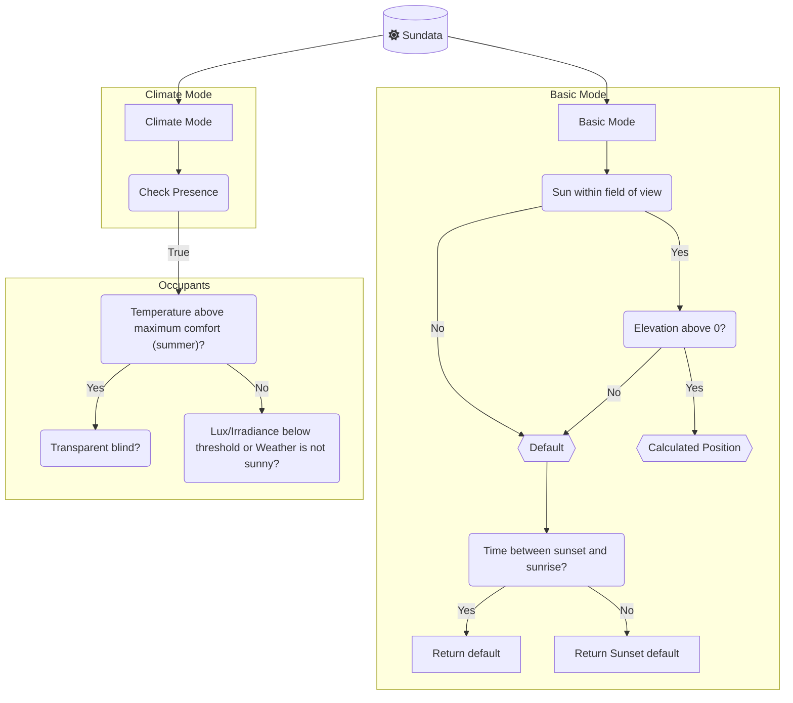

# Adaptive Cover (NET Fork)

Sun-tracking cover control for Home Assistant: vertical blinds, awnings, and venetian tilts with optional climate-aware strategies.

**This repo:** [disruptivepatternmaterial/adaptive-cover](https://github.com/disruptivepatternmaterial/adaptive-cover)  
**Current release:** [v0.3.0b3](https://github.com/disruptivepatternmaterial/adaptive-cover/releases/tag/v0.3.0b3)  
**HACS name:** `Adaptive Cover (NET Fork)`  
**Integration domain:** `adaptive_cover`

Fork lineage: [basbruss/adaptive-cover](https://github.com/basbruss/adaptive-cover) → [rako79/adaptive-cover](https://github.com/rako79/adaptive-cover) → this fork.

Based on the community template approach: [Automatic Blinds](https://community.home-assistant.io/t/automatic-blinds-sunscreen-control-based-on-sun-platform/).

---

## Install (HACS)

1. HACS → **Integrations** → **⋮** → **Custom repositories**
2. Add `https://github.com/disruptivepatternmaterial/adaptive-cover` as type **Integration**
3. Search **Adaptive Cover (NET Fork)** → **Download**
4. Restart Home Assistant
5. **Settings → Devices & services → Add integration** → **Adaptive Cover (NET Fork)**

Do **not** add `basbruss/adaptive-cover` — that is upstream and a different release line (v1.4.x). This fork uses **0.3.0b*** versioning.

After adding the custom repo once, updates: HACS → **Adaptive Cover (NET Fork)** → **Update** (should show **v0.3.0b3** when [GitHub release](https://github.com/disruptivepatternmaterial/adaptive-cover/releases) exists).

### Manual install

Copy `custom_components/adaptive_cover/` to `/config/custom_components/` and restart HA.

---

## Deploy checklist (BowmanMtn)

| Step | Command / action |
|------|------------------|
| Pull latest | HACS → Update **Adaptive Cover (NET Fork)** |
| Verify version | `/config/custom_components/adaptive_cover/manifest.json` → `"version": "0.3.0b3"` |
| Restart | Restart Home Assistant |
| Smoke test | Manually hold a shade closed → restart HA → shade should **not** reopen on first refresh |

---

## NET Fork changes (changelog)

### v0.3.0b3

- **17 Code Review Bug Fixes:**
  - **get_blind_data UnboundLocalError:** Fixed a crash where an unrecognized cover type would raise `UnboundLocalError`.
  - **async_timed_refresh UnboundLocalError:** Initialized `time` to `None` and added an early return to prevent crashes when both end-time fields are `None`.
  - **async_check_cover_state_change AttributeError:** Added a guard for `new_state=None` (which occurs when cover entities are removed from HA).
  - **handle_state_change TypeError:** Guarded both position comparison sites against `None` positions (e.g. when cover is mid-travel or unavailable).
  - **lux / irradiance TypeError:** Added safety guards and `try/except` blocks around `float()` conversions for unavailable sensors.
  - **switch.py TypeError:** Added a fallback default list to `config_entry.options.get(CONF_ENTITIES, [])` to prevent crashes when the key is absent.
  - **after_start_time assignment fix:** Restored the missing `self._start_time = time` assignment (was a dead expression).
  - **control_method reset:** Reset `control_method` to `"intermediate"` at the start of each update cycle to prevent sticky `"summer"` status.
  - **climate_mode_data optimization:** Reused a single `ClimateCoverState` instance to avoid running the full decision tree twice per cycle.
  - **CONF_START_ENTITY tracking:** Added the start-time entity to the state-change listener list.
  - **button.py hang prevention:** Capped the manual override reset busy-wait loop at 30 seconds to prevent indefinite task hangs.
  - **utcnow deprecation:** Replaced deprecated `datetime.utcnow()` with `datetime.now(_dt.UTC)`.
  - **outside_high bias fix:** Default to `False` instead of `True` when the outdoor temperature sensor is offline, ensuring we don't assume summer heat and block solar gain during outages.
  - **helpers.py timezone fix:** Replaced `ignoretz=True` in `get_datetime_from_str` with proper timezone-aware parsing and conversion to local naive datetime.
  - **sun.py caching:** Cached the `self.times` property inside the solar azimuth/elevation loops to avoid rebuilding the `DatetimeIndex` on every iteration.
  - **async_initialize_integration cleanup:** Removed dead/unused initialization function.

### v0.3.0b2

- **README:** full NET Fork install/deploy docs, changelog, tests, corrected HACS/repo URLs and badges

### v0.3.0b1

- **Manual override persistence:** `manual_control` and `manual_control_time` stored in HA `Store` (`adaptive_cover.{entry_id}.manual_state`); restored before first coordinator refresh after HA restart  
  - Fixes shades reopening to calculated night positions after reboot when they were manually held closed
- **Startup guard:** cover position drives deferred until **all** switch entities report restored state (`expected_restore_ids` / `mark_switch_restored` on coordinator)
- **HACS/manifest:** renamed **Adaptive Cover (NET Fork)**; docs/issue tracker point at this repo
- **Tests:** `tests/test_coordinator_manual_persist.py` (13 tests)

### Prior NET Fork commits (already in main)

- **Window-open latch:** `_last_window_open_ts` survives flaky contact sensors (hold max open for `window_open_hold`)
- **Winter overrides anti-glare** in `normal_with_presence` climate path
- **Multi-window sensors:** `window_entity` accepts a list; separate `cloud_coverage` source
- **Config flow:** legacy single-string `window_entity` coerced to list for multi-select UI

---

## Tests

```bash
cd adaptive-cover
python3 -m pytest tests/ -v
```

Requires only `pytest` (HA libs stubbed in `tests/conftest.py`). **13 tests** cover Store load/save, malformed timestamp handling, and switch-restore gate.

---

## Features

- Individual configs for `vertical`, `horizontal`, and `tilted` covers
- **Basic** and **Climate** modes ([details below](#modes))
- Binary sensor: sun in front of window
- Start/end sun time sensors
- Auto manual-override detection (with NET Fork persistence across restart)
- Climate: weather, presence, lux/irradiance thresholds
- Adaptive control toggle, multi-cover, delta/time gates, sunset position

---

## Setup

Find window azimuth on [Open Street Map Compass](https://osmcompass.com/). Choose cover type in the integration config flow.

## Cover Types

|              | Vertical                      | Horizontal                      | Tilted                          |
| ------------ | ----------------------------- | ------------------------------- | ------------------------------- |
|              |  |  |  |
| **Movement** | Up/Down                       | In/Out                          | Tilting                         |
|              | [variables](#vertical)        | [variables](#horizontal)        | [variables](#tilt)              |

## Modes

Two strategy modes: **basic** (sun position only) and **climate** (presence + temperature + weather).



### Basic mode

Uses sun elevation/azimuth and field-of-view to compute shade position. Outside the sun window, uses default height or sunset position.

### Climate mode

Split into [presence](https://github.com/disruptivepatternmaterial/adaptive-cover#presence) and [no-presence](https://github.com/disruptivepatternmaterial/adaptive-cover#no-presence) strategies (see upstream docs in git history for full tables).

---

## Variables

### Common

| Name                 | Default | Range | Description                                      |
| -------------------- | ------- | ----- | ------------------------------------------------ |
| Azimuth              | None    | 0-360 | Window azimuth                                   |
| Default Height       | 50      | 0-100 | Position when sun not in FOV (day)               |
| Sunset Position      | 0       | 0-100 | Position after sunset                            |
| Field of View Left   | 90      | 0-180 | Degrees left of azimuth                          |
| Field of View Right  | 90      | 0-180 | Degrees right of azimuth                         |
| Minimum Elevation    | 0       | 0-90  | Ignore sun below this elevation                  |
| Maximum Elevation    | 90      | 0-90  | Ignore sun above this elevation                  |
| Manual Override Duration | 15 min | | How long manual hold lasts                    |
| Window Open Hold     | 30 min  |       | Keep covers open after window closes (flaky contacts) |

(Full variable tables for vertical/horizontal/tilt/climate/blindspot unchanged from upstream — see [basbruss/adaptive-cover](https://github.com/basbruss/adaptive-cover) for reference.)

---

## Entities

| Entity | Description |
|--------|-------------|
| `sensor.{type}_cover_position_{name}` | Calculated target position |
| `sensor.{type}_control_method_{name}` | `winter` / `summer` / `intermediate` (climate mode) |
| `binary_sensor.{type}_manual_override_{name}` | Any cover under manual hold |
| `switch.{type}_toggle_control_{name}` | Enable adaptive drives |
| `switch.{type}_manual_override_{name}` | Enable manual-override detection |
| `button.{type}_reset_manual_override_{name}` | Clear manual holds |


Climate mode adds `switch.{type}_climate_mode_{name}` and optional outside-temperature toggle.

---

## Credits

Original: [basbruss/adaptive-cover](https://github.com/basbruss/adaptive-cover).  
NET Fork: [disruptivepatternmaterial/adaptive-cover](https://github.com/disruptivepatternmaterial/adaptive-cover).
