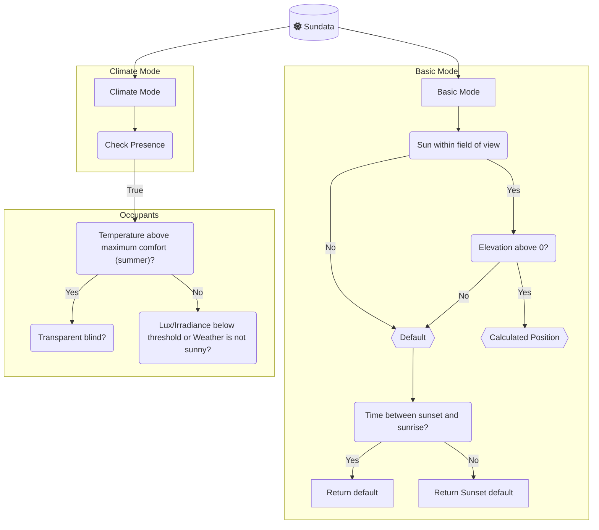

# Adaptive Cover (NET Fork)

Sun-tracking cover control for Home Assistant: vertical blinds, awnings, and venetian tilts with optional climate-aware strategies.

**This repo:** [disruptivepatternmaterial/adaptive-cover](https://github.com/disruptivepatternmaterial/adaptive-cover)  
**Current release:** [v0.3.7](https://github.com/disruptivepatternmaterial/adaptive-cover/releases/tag/v0.3.7)  
**HACS name:** `Adaptive Cover (NET Fork)`  
**Integration domain:** `adaptive_cover`

Fork lineage: [basbruss/adaptive-cover](https://github.com/basbruss/adaptive-cover) → [rako79/adaptive-cover](https://github.com/rako79/adaptive-cover) → this fork.

Based on the community template approach: [Automatic Blinds](https://community.home-assistant.io/t/automatic-blinds-sunscreen-control-based-on-sun-platform/).

---

## Install (HACS)

1. HACS → **Integrations** → **⋮** → **Custom repositories**
2. Add `https://github.com/disruptivepatternmaterial/adaptive-cover` as type **Integration**
3. Search **Adaptive Cover (NET Fork)** → **Download**
4. Restart Home Assistant
5. **Settings → Devices & services → Add integration** → **Adaptive Cover (NET Fork)**

Do **not** add `basbruss/adaptive-cover` — that is upstream and a different release line (v1.4.x). This fork uses **0.3.x** versioning.

After adding the custom repo once, updates appear as: HACS → **Adaptive Cover (NET Fork)** → **Update**.

### Manual install

Copy `custom_components/adaptive_cover/` to `/config/custom_components/` and restart HA.

---

## Deploy checklist (BowmanMtn)

| Step | Command / action |
|------|------------------|
| Pull latest | HACS → Update **Adaptive Cover (NET Fork)** |
| Verify version | `/config/custom_components/adaptive_cover/manifest.json` → `"version": "0.3.7"` |
| Restart | Restart Home Assistant |
| Smoke test | Manually hold a shade closed → restart HA → shade should **not** reopen on first refresh |

---

## NET Fork changes (changelog)

### v0.3.7 — Lower-priority bug fixes (multi-model review round 2)

A second pass of fixes targeting correctness issues found during a 4-model adversarial code review of v0.3.6.

**`coordinator.py` — `async_timed_refresh`**
- Midnight end-times (00:00) now fire correctly. The function previously compared against the raw parsed time without applying the `+1 day` rollover that `_end_time` applies, causing midnight-configured end-times to always be in the past and never trigger.
- Trigger window widened from a strict `<= 1s` to `abs(delta) <= 60s` so event-loop pressure does not silently skip a legitimate callback.
- Added a `None` guard after `get_datetime_from_str` so unparseable end-time entity states return early instead of crashing.

**`coordinator.py` — `climate_mode_data`**
- Changed two independent `if` blocks to `if/elif` so `"winter"` cannot silently override `"summer"` when both are simultaneously `True` (possible when `temp_high < temp_low` is misconfigured). Logs a `warning` in that case so the user knows their thresholds are inverted.

**`calculation.py` — `solar_times()`**
- Snapshots `sun_data.times` once and uses the same `DatetimeIndex` for both azimuth, elevation, and `set_index`. Previously three separate `times` calls could yield arrays from different seconds if a midnight boundary was crossed mid-call, causing a misaligned solar position table.

**`sun.py` — `solar_azimuth` / `solar_elevation`**
- Simplified now that `solar_times()` owns the shared snapshot. Removed an inaccurate comment that claimed the local variable cache was an optimization (Python evaluates a `for ... in <expr>` exactly once; the cache was a no-op).

**`helpers.py` — `get_datetime_from_str`**
- Now returns `None` instead of raising `ValueError`/`OverflowError` when a non-datetime sensor state is configured for start/end time entities. Callers already check for `None` before doing datetime arithmetic.

---

### v0.3.6 — Critical + logic bug fixes (code review, 22 total fixes)

Full code review pass covering all source files. Fixes span crashes, silent logic bugs, behavioral correctness, and quality improvements.

#### Crashes fixed

| File | Bug | Fix |
|------|-----|-----|
| `coordinator.py` | `get_blind_data` used three independent `if` blocks — unknown cover type raised `UnboundLocalError` | Changed to `if/elif/else` with explicit `ValueError` |
| `coordinator.py` | `async_timed_refresh` left `time` unbound when both `end_time` and `end_time_entity` were `None` | Initialize to `None`; added early return |
| `coordinator.py` | `async_check_cover_state_change` had no guard for `new_state=None` (fires when cover entity removed from HA) | Added early return |
| `coordinator.py` | `handle_state_change` called `abs(target - new_position)` / `abs(our_state - new_position)` without checking `new_position` for `None` (mid-travel or unavailable) | Guarded both arithmetic sites; added early return |
| `coordinator.py` | `after_start_time`: entity path crashed with `TypeError` when start-time entity was unavailable (`now >= None`) | Added `None` guard before datetime comparison; returns `False` (safe default) on unavailable entity |
| `coordinator.py` | `async_timed_refresh`: entity unavailability overwrote the config fallback with `None`, silently skipping the timed refresh | Entity value only applied when non-`None`; static config retained as fallback |
| `calculation.py` | `lux` / `irradiance` called `float(None)` when sensor unavailable | Added `None` guard + `try/except (TypeError, ValueError)` |
| `calculation.py` | `get_current_temperature` called `float()` unguarded on inside and outside temperature values | Wrapped both paths in `try/except` |
| `switch.py` | `len(config_entry.options.get(CONF_ENTITIES))` raised `TypeError` when key absent | Added `[]` default |

#### Logic / behavioral bugs fixed

| File | Bug | Fix |
|------|-----|-----|
| `coordinator.py` | `after_start_time` — `self._start_time` was a dead no-op expression instead of `self._start_time = time` | Assignment restored |
| `coordinator.py` | `control_method` never reset between update cycles — summer→neither-season left sensor permanently showing `"summer"` | Reset to `"intermediate"` at the start of each `climate_mode_data()` call |
| `coordinator.py` | `ClimateCoverState` constructed twice per update cycle in `climate_mode_data`, running the full decision tree twice | Reuse the single instance |
| `coordinator.py` | `button.py` — on 30s timeout, `wait_for_target` and `target_call` were left dirty, permanently suppressing manual-override detection for that cover | Clear both dicts on timeout |
| `calculation.py` | `outside_high` returned `True` (assume "hot outside") when sensor unavailable, biasing `is_summer` during outages | Returns `False` when sensor unavailable; returns `True` when no outdoor threshold is configured (preserving summer-mode behavior for users without an outdoor sensor) |
| `__init__.py` | `CONF_START_ENTITY` missing from state-change listener list — dynamic start-time entity changes never triggered a refresh | Added alongside `CONF_END_ENTITY` |

#### Quality / minor fixes

| File | Fix |
|------|-----|
| `__init__.py` | Removed dead `async_initialize_integration` function (never called) |
| `button.py` | Unbounded busy-wait capped at 30s with `warning` log |
| `calculation.py` | `datetime.utcnow()` deprecated in Python 3.12 — replaced with `datetime.now(_dt.UTC)` |
| `helpers.py` | `ignoretz=True` silently discarded timezone info from HA `input_datetime` strings — now converts aware strings to local naive datetime; guards against `ParserError` with `try/except` |
| `coordinator.py` | `check_position` log message said "Cover is already at position" when entity was actually unavailable — corrected |

---

### v0.3.0b2

- **README:** full NET Fork install/deploy docs, changelog, tests, corrected HACS/repo URLs and badges

### v0.3.0b1

- **Manual override persistence:** `manual_control` and `manual_control_time` stored in HA `Store` (`adaptive_cover.{entry_id}.manual_state`); restored before first coordinator refresh after HA restart
  - Fixes shades reopening to calculated night positions after reboot when they were manually held closed
- **Startup guard:** cover position drives deferred until **all** switch entities report restored state (`expected_restore_ids` / `mark_switch_restored` on coordinator)
- **HACS/manifest:** renamed **Adaptive Cover (NET Fork)**; docs/issue tracker point at this repo
- **Tests:** `tests/test_coordinator_manual_persist.py` (13 tests)

### Prior NET Fork commits (already in main)

- **Window-open latch:** `_last_window_open_ts` survives flaky contact sensors (hold max open for `window_open_hold`)
- **Winter overrides anti-glare** in `normal_with_presence` climate path
- **Multi-window sensors:** `window_entity` accepts a list; separate `cloud_coverage` source
- **Config flow:** legacy single-string `window_entity` coerced to list for multi-select UI

---

## Tests

```bash
cd adaptive-cover
python3 -m pytest tests/ -v
```

Requires only `pytest` (HA libs stubbed in `tests/conftest.py`). **13 tests** cover Store load/save, malformed timestamp handling, and switch-restore gate.

---

## Features

- Individual configs for `vertical`, `horizontal`, and `tilted` covers
- **Basic** and **Climate** modes ([details below](#modes))
- Binary sensor: sun in front of window
- Start/end sun time sensors (supports dynamic `input_datetime` entities)
- Auto manual-override detection with persistence across HA restarts
- Climate: weather, presence, lux/irradiance thresholds, predictive summer detection via `weather.get_forecasts`
- Adaptive control toggle, multi-cover support, position/time delta gates, sunset position
- Window-open latch: holds covers open for configurable duration after contact sensor closes (guards against flaky sensors)
- Cloud coverage deadband (35–65%) with optional dedicated cloud coverage entity

---

## Setup

Find window azimuth on [Open Street Map Compass](https://osmcompass.com/). Choose cover type in the integration config flow.

## Cover Types

|              | Vertical                      | Horizontal                      | Tilted                          |
| ------------ | ----------------------------- | ------------------------------- | ------------------------------- |
|              |  |  |  |
| **Movement** | Up/Down                       | In/Out                          | Tilting                         |
|              | [variables](#vertical)        | [variables](#horizontal)        | [variables](#tilt)              |

## Modes

Two strategy modes: **basic** (sun position only) and **climate** (presence + temperature + weather).



### Basic mode

Uses sun elevation/azimuth and field-of-view to compute shade position. Outside the sun window, uses default height or sunset position.

### Climate mode

Split into presence and no-presence strategies:

**With occupants:**
- **Winter** (temp below `temp_low`) + sun in window → fully open (100%) for solar gain
- Not summer + dim/cloudy → default position
- Summer + transparent blind → fully closed (0%)
- Otherwise → anti-glare geometric calculation

**Without occupants:**
- Summer + sun in window → fully closed
- Winter + sun in window → fully open
- Otherwise → default position

**Predictive summer detection:** when a weather entity is configured, `weather.get_forecasts` is called to retrieve today's forecast high. If the forecast exceeds the outdoor threshold by 2°, summer mode activates before the room heats up.

---

## Variables

### Common

| Name                     | Default  | Range  | Description                                            |
| ------------------------ | -------- | ------ | ------------------------------------------------------ |
| Azimuth                  | None     | 0-360  | Window azimuth (compass bearing the window faces)      |
| Default Height           | 50       | 0-100  | Position when sun not in FOV (daytime)                 |
| Sunset Position          | 0        | 0-100  | Position after sunset / before sunrise                 |
| Field of View Left       | 90       | 0-180  | Degrees left of window azimuth                         |
| Field of View Right      | 90       | 0-180  | Degrees right of window azimuth                        |
| Minimum Elevation        | 0        | 0-90   | Ignore sun below this elevation                        |
| Maximum Elevation        | 90       | 0-90   | Ignore sun above this elevation                        |
| Sunset Offset            | 0        | min    | Minutes after sunset to switch to sunset position      |
| Sunrise Offset           | 0        | min    | Minutes after sunrise to switch back from sunset pos   |
| Manual Override Duration | 15 min   |        | How long a manual hold lasts before auto-resuming      |
| Window Open Hold         | 30 min   |        | Keep covers at max after window sensor closes          |
| Start Time               | None     |        | Don't drive covers before this time (static or entity) |
| End Time                 | None     |        | Return to sunset position at this time                 |
| Delta Position           | 1%       |        | Minimum position change before commanding cover        |
| Delta Time               | 2 min    |        | Minimum time between cover commands                    |

### Climate mode additional variables

| Name                      | Description                                                    |
| ------------------------- | -------------------------------------------------------------- |
| Temperature Entity        | Inside temperature sensor or climate entity                    |
| Temp Low                  | Below this → winter mode (solar gain)                         |
| Temp High                 | Above this → summer mode (shade)                              |
| Outside Temp Entity       | Optional outdoor temperature sensor                            |
| Outside Threshold         | Outdoor temp must exceed this for summer mode to activate      |
| Presence Entity           | `device_tracker`, `zone`, `binary_sensor`, or `input_boolean` |
| Weather Entity            | Used for cloud coverage and forecast high                      |
| Cloud Coverage Entity     | Optional dedicated cloud coverage sensor (e.g. WeatherFlow)    |
| Lux Entity / Threshold    | Below threshold → not bright enough to shade                   |
| Irradiance Entity / Threshold | Below threshold → not bright enough to shade               |
| Transparent Blind         | If set, fully closes in summer instead of computing position   |

(Full variable tables for blindspot configuration unchanged from upstream — see [basbruss/adaptive-cover](https://github.com/basbruss/adaptive-cover) for reference.)

---

## Entities

| Entity | Description |
|--------|-------------|
| `sensor.{name}_cover_position` | Calculated target position (%) |
| `sensor.{name}_start_sun` | Timestamp when sun enters the window FOV today |
| `sensor.{name}_end_sun` | Timestamp when sun leaves the window FOV today |
| `sensor.{name}_control_method` | `winter` / `summer` / `intermediate` / `basic` |
| `sensor.{name}_algorithm_status` | Why the cover is at its current position (`auto`, `window_open`, `max_limit`, `min_limit`, `night_mode`, `calculating`) |
| `binary_sensor.{name}_sun_infront` | `True` when sun is geometrically in the window FOV |
| `binary_sensor.{name}_manual_override` | `True` when any cover is under manual hold |
| `switch.{name}_toggle_control` | Master on/off for adaptive driving |
| `switch.{name}_manual_override` | Enable/disable manual override detection |
| `switch.{name}_climate_mode` | Toggle between basic and climate strategies |
| `switch.{name}_outside_temperature` | Toggle inside vs outside temp source |
| `switch.{name}_lux` | Enable lux brightness gating |
| `switch.{name}_irradiance` | Enable irradiance gating |
| `button.{name}_reset_manual_override` | Clear all manual holds and return to auto |
| `select.{name}_manual_override_duration` | Pick override duration (0/15/30/60/120/240 min or sunset) |


---

## How Manual Override Detection Works

When a cover moves to a position that differs from the integration's last commanded target by more than the configured `manual_threshold` (default 5%), the cover is marked as manually controlled. While marked manual, the integration stops driving that cover.

The manual hold expires after `manual_override_duration` (configurable per entry). It also persists across HA restarts — the integration saves manual state to HA's `.storage/adaptive_cover.{entry_id}.manual_state` and restores it on startup.

ZHA/Tuya covers commonly report `current_position` 1–2% off from the commanded value (e.g. commanded 100, reported 99). The `manual_threshold` tolerance handles this — the integration distinguishes its own drives from human intervention.

Use the **Reset Manual Override** button to clear holds and return covers to calculated positions immediately.

---

## Credits

Original: [basbruss/adaptive-cover](https://github.com/basbruss/adaptive-cover).  
NET Fork: [disruptivepatternmaterial/adaptive-cover](https://github.com/disruptivepatternmaterial/adaptive-cover).
